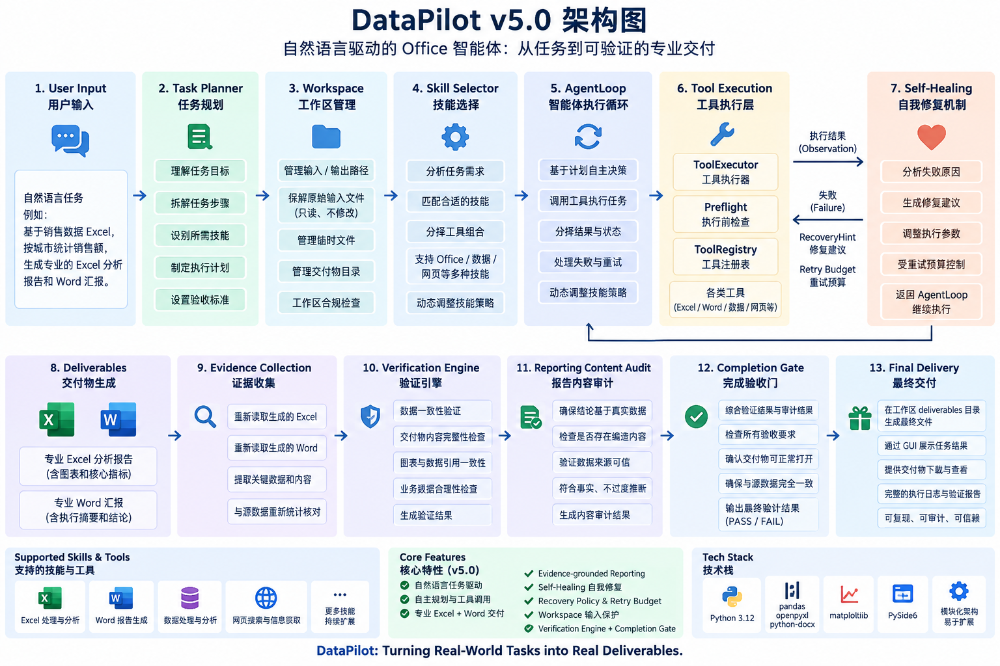
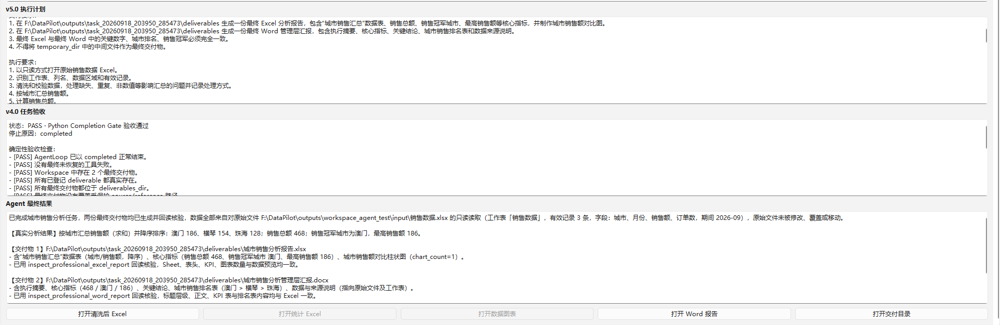
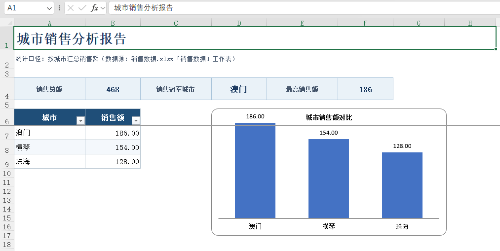
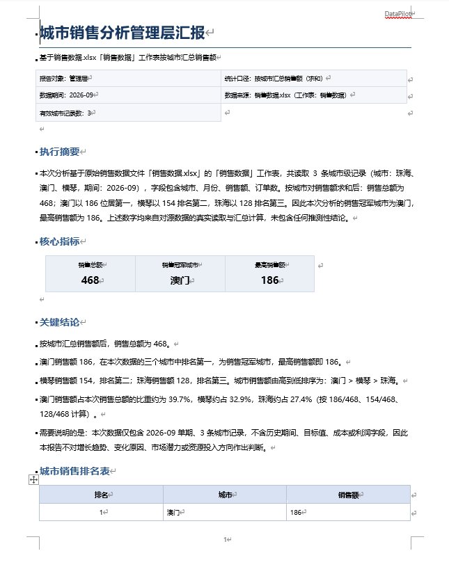

# DataPilot

> 一个面向真实办公数据任务的桌面端 AI
> Agent：用户用自然语言描述目标，DataPilot
> 自主规划任务、选择工作流与工具、处理数据、生成 Excel / Word
> 交付物，并通过确定性验证后才宣布任务完成。

**当前版本：v5.0**

DataPilot
不是一个只负责"聊天"的办公助手。它的目标是把自然语言办公需求转换成可执行、可追踪、可恢复、可验收的真实工作流。

典型任务：

> 读取销售数据 Excel，按城市统计销售额，找出销售冠军，同时生成专业 Excel
> 分析报告和管理层 Word
> 汇报；两个文件的数据必须一致，不得覆盖源文件，生成后重新读取并核验，确认无误后再完成任务。

------------------------------------------------------------------------

## 项目亮点

### 1. 自主任务规划

DataPilot 在执行工具之前先通过 `Task Planner`
将自然语言任务转换成结构化任务合同（TaskPlan），明确：

-   任务目标
-   数据与来源要求
-   最终交付要求
-   执行要求
-   验收要求
-   安全要求
-   必要假设

Planner 只负责规划，不直接执行办公工具。

### 2. Skill + Tool 分层架构

DataPilot 将"工作方法"和"原子能力"分开：

-   **Skill**：描述完成某类办公任务的推荐工作流、工具组合、验收规则和安全边界。
-   **Tool**：真正执行读取、统计、排序、Excel/Word
    生成、文件检查等原子操作。

当前通用 Office Skills 包括：

-   `excel_data_analysis`
-   `excel_report_delivery`
-   `existing_excel_edit`
-   `existing_word_edit`
-   `document_summary`
-   `cross_file_office_workflow`
-   `professional_word_delivery`

Skill Selector 会根据用户任务与 TaskPlan 选择相关 Skill
Guidance，但不会限制底层 Tool Registry。

### 3. AgentLoop 自主执行

AgentLoop 根据当前真实执行状态逐步决定下一步，而不是预先写死整条流水线。

每次工具调用都会形成 Observation，并进入下一轮决策上下文，因此 Agent
能根据真实结果继续分析、修正或完成任务。

### 4. 专业 Excel / Word 交付

DataPilot 可以生成面向实际办公场景的正式交付物。

**Professional Excel Report**

-   报告标题与副标题
-   KPI 核心指标
-   业务数据表
-   自动列宽、冻结窗格、筛选
-   数字格式
-   原生 Excel 图表
-   最终文件重新读取检查

**Professional Word Report**

-   报告标题与元数据
-   执行摘要
-   KPI 核心指标
-   关键结论
-   业务表格
-   数据来源说明
-   页眉、页码与统一版式
-   最终文件重新读取检查

### 5. Evidence-grounded Reporting

DataPilot 不允许报告把模型推测包装成事实。

对于单期横截面数据，系统会限制缺乏证据的高风险表述，例如：

-   "持续领先"
-   "增长 / 下降趋势"
-   "原因是......"
-   "市场潜力更高"
-   "应加大资源投入"

事实、计算结论和建议会被区别处理。关键结论需要真实工具 Observation
或可确定推导的数据证据。

### 6. Self-Healing Tool Recovery

真实办公自动化不可避免会遇到错误。DataPilot
不把工具失败直接等同于任务失败。

``` text
Tool Failure
    ↓
Failure Classification
    ↓
RecoveryHint
    ↓
Agent 根据真实 Observation 修正策略
    ↓
重新执行真实 Tool
    ↓
成功后继续任务
```

已经覆盖的恢复场景包括：

-   参数签名错误
-   参数类型错误
-   输出路径安全冲突
-   文件不存在
-   Sheet 不存在
-   字段不存在
-   引用解析失败
-   Rate Limit
-   Permission
-   未知错误的保守处理

RecoveryHint 只负责诊断与指导，不会绕过 ToolExecutor、ToolPreflight 或
ToolRegistry，也不会自动伪造成功。

### 7. Recovery Policy / Retry Budget

Self-Healing 不意味着无限重试。

DataPilot 在 Python 层维护确定性的 Retry Budget：

-   相同 `tool + arguments` 的可恢复失败达到预算后，禁止继续原样执行。
-   `recoverable=false` 的完全相同调用不会被盲目重复。
-   如果 Agent
    真正修改了错误列名、输出路径、引用或工具，则形成新的调用签名，可以继续恢复。
-   达到恢复预算后，以 `recovery_exhausted`
    明确停止，而不是一直消耗模型轮数。

因此模型即使反复做出相同错误决策，也无法造成无限工具重试。

### 8. Workspace 与输出安全

每个任务拥有独立 Workspace：

``` text
outputs/
└── task_<timestamp>/
    ├── temporary/
    ├── deliverables/
    └── manifest.json
```

核心安全约束：

-   source / reference 输入自动登记为受保护文件
-   禁止最终输出覆盖原始输入
-   临时文件进入 `temporary_dir`
-   最终交付物进入 `deliverables_dir`
-   ToolPreflight 在真实执行前检查路径与参数
-   Workspace 记录最终交付物与任务状态

### 9. Verification Engine + Completion Gate

在 DataPilot 中，LLM 说"完成"不代表任务真的完成。

``` text
LLM finish
    ↓
Completion Request
    ↓
Verification Engine
    ↓
检查真实文件 / Observation / TaskPlan
    ↓
PASS → completed
FAIL / pending → 返回 Agent 继续修正
```

Verification Engine 会检查：

-   AgentLoop 是否正常完成
-   是否仍有未恢复工具失败
-   必需交付物是否真实存在
-   是否位于 `deliverables_dir`
-   是否覆盖受保护输入
-   最终文件是否在写入后重新读取
-   关键业务要求是否具有真实 Evidence
-   多交付物之间关键数据是否一致
-   报告是否包含缺乏证据支持的高风险确定性断言

最终完成权属于 Python Completion Gate，而不是语言模型。

------------------------------------------------------------------------

## v5.0 架构

<p align="center">
  
</p>

<p align="center">
  <em>DataPilot v5.0：从自然语言任务规划、Skill 选择与真实工具执行，到 Self-Healing、Evidence Verification 和最终 Office 交付。</em>
</p>

DataPilot 将 LLM 的任务理解与自主决策能力，与 Python 层的确定性执行、安全控制和最终验收结合起来。Agent 可以根据真实 Observation 动态调整下一步；工具失败时进入 Recovery / Retry Budget，自救成功后继续执行，最终交付物必须经过重新读取、Evidence 检查、跨交付物一致性验证与 Completion Gate 才能完成任务。

------------------------------------------------------------------------

## Demo Showcase：自然语言任务 → Verified Office Delivery

下面展示的是 DataPilot v5.0 的真实桌面 GUI 综合验收案例。用户只需要描述办公目标并提供源 Excel，Agent 会自主完成规划、数据处理、Office 交付、失败恢复与最终验证。

### 1. Natural Language Task → Completion Gate PASS

本次任务要求 DataPilot 读取真实销售数据，按城市汇总并排序，计算销售总额与销售冠军，同时生成专业 Excel 分析报告和 Word 管理层汇报。两个交付物必须使用同一份分析结果、不得覆盖源文件，并在生成后重新读取核验。

<p align="center">
  
</p>

<p align="center">
  <em>自然语言任务经过 TaskPlan、Skill Selection、真实工具执行和文件回读后，由 Python Completion Gate 验收通过。</em>
</p>

本次真实 Demo 最终状态：

- **Completion Gate：PASS**
- **停止原因：`completed`**
- **最终交付物：2 个**
- **Agent 决策轮数：12**
- **真实工具调用：11**

真实统计结果：

| 排名 | 城市 | 销售额 |
| ---: | --- | ---: |
| 1 | 澳门 | 186 |
| 2 | 横琴 | 154 |
| 3 | 珠海 | 128 |

核心指标：**销售总额 468 / 销售冠军城市 澳门 / 最高销售额 186**。

### 2. Professional Excel Delivery

DataPilot 基于真实汇总结果生成专业 Excel 分析报告，包含 KPI、城市销售汇总表和 Excel 原生柱状图。

<p align="center">
  
</p>

<p align="center">
  <em>Excel 交付物：销售总额、冠军城市、最高销售额、降序汇总表与城市销售额对比图。</em>
</p>

最终文件：`城市销售分析报告.xlsx`

### 3. Professional Word Delivery

同一份分析结果同时生成面向管理层阅读的 Word 汇报，包含执行摘要、核心指标、关键结论、城市销售排名表和数据来源说明。

<p align="center">
  
</p>

<p align="center">
  <em>Word 交付物：管理层摘要、KPI、关键结论、排名表与 Evidence-grounded 数据边界说明。</em>
</p>

最终文件：`城市销售分析管理层汇报.docx`

由于源数据只有单期数据，报告不会把横截面排序扩写成“增长趋势”“变化原因”“市场潜力”或“资源投入优先级”等缺乏证据支持的确定性结论。

### 4. Real Self-Healing During the Demo

这次 Showcase 不是一条预先写死且全程无错误的流水线。第一次调用 Professional Word Report Tool 时，`table section` 的 `rows` 参数类型不符合工具要求：

```text
create_professional_word_report
→ TypeError
→ table section 的 rows 必须是字典列表
```

DataPilot 没有把失败伪装成成功，而是把真实 Tool Failure 转换成 RecoveryHint / Observation，由 Agent 在下一轮修改参数并重新执行：

```text
真实 Tool Failure
        ↓
Failure Classification
        ↓
RecoveryHint / Observation
        ↓
Agent 修改工具参数
        ↓
重新执行真实 Tool
        ↓
Word 创建成功
        ↓
重新读取 Excel / Word
        ↓
Evidence + Cross-deliverable Verification
        ↓
Python Completion Gate PASS
```

这个案例同时验证了 DataPilot 的 **自主执行、Self-Healing、Office 双交付、Evidence-grounded Reporting、跨交付物一致性验证和确定性 Completion Gate**，而不仅是展示两个已经生成好的文件。

------------------------------------------------------------------------

## 主要模块

  模块                                  作用
  ------------------------------------- -----------------------------
  `main.py`                             PySide6 桌面 GUI
  `agent.py`                            DataPilot Agent 上层入口
  `task_planner.py`                     自然语言 → TaskPlan
  `agent_loop.py`                       Agent 自主决策循环
  `skill_registry.py`                   Office Skill 定义与注册
  `skill_selector.py`                   根据任务选择 Skill Guidance
  `tool_registry.py`                    原子工具注册
  `tool_executor.py`                    统一工具执行入口
  `tool_preflight.py`                   执行前参数与安全检查
  `tool_failure_recovery.py`            工具失败分类与 RecoveryHint
  `verification_engine.py`              确定性任务验收
  `reporting_content_audit.py`          报告内容证据审计
  `workspace_manager.py`                Workspace 与交付物治理
  `execution_context.py`                执行上下文与引用管理
  `office_data_tools.py`                Office 数据读取与处理
  `excel_report_tools.py`               专业 Excel 报告
  `professional_word_report_tools.py`   专业 Word 报告
  `excel_edit_tools.py`                 已有 Excel 编辑能力
  `word_edit_tools.py`                  已有 Word 编辑能力
  `document_tools.py`                   文档处理能力
  `document_selector.py`                文档选择与识别
  `file_discovery_tools.py`             文件发现与检查
  `web_data_tools.py`                   Web 数据相关能力
  `web_search_tools.py`                 Web 搜索相关能力

------------------------------------------------------------------------

## 技术栈

### Agent / LLM

-   Python
-   OpenAI-compatible SDK
-   DeepSeek-compatible API
-   Pydantic
-   python-dotenv

### Data & Office

-   pandas
-   NumPy
-   openpyxl
-   python-docx
-   pypdf
-   lxml

### Desktop

-   PySide6

### Visualization

-   Matplotlib
-   Pillow

### Data / Web

-   requests
-   BeautifulSoup
-   DDGS

### Engineering

-   Git / GitHub
-   Python venv
-   Deterministic validation
-   Workspace isolation
-   Tool registry architecture
-   E2E regression testing

------------------------------------------------------------------------

## 环境要求

推荐：

``` text
Python 3.11+
Windows
```

项目当前主要在 Windows + PowerShell + Python virtual environment
环境中开发和验证。

------------------------------------------------------------------------

## 安装

克隆项目：

``` bash
git clone https://github.com/Zawaii-L/DataPilot.git
cd DataPilot
```

创建虚拟环境：

``` powershell
python -m venv .venv
.\.venv\Scripts\Activate.ps1
```

安装核心依赖：

``` powershell
pip install openai pandas numpy openpyxl python-docx python-dotenv PySide6 matplotlib pillow pypdf lxml requests beautifulsoup4 ddgs pydantic
```

当前 v5.0 开发环境中主要依赖版本包括：

``` text
openai==3.14.1
pandas==3.0.5
numpy==2.4.6
openpyxl==3.1.5
python-docx==1.2.0
python-dotenv==1.2.3
PySide6==6.11.2
matplotlib==3.11.2
pillow==12.3.0
pypdf==6.19.0
lxml==6.1.3
requests==2.34.2
beautifulsoup4==4.15.0
ddgs==9.16.0
pydantic==2.13.5
```

> 后续建议使用仓库中的 `requirements.txt` 固化完整可复现依赖。

------------------------------------------------------------------------

## 配置 LLM

DataPilot 使用 OpenAI-compatible API 客户端。

请在项目根目录创建本地 `.env`，并根据你使用的模型服务配置 API Key、Base
URL 与模型名称。

示例：

``` dotenv
OPENAI_API_KEY=your_api_key_here
OPENAI_BASE_URL=your_openai_compatible_base_url
OPENAI_MODEL=your_model_name
```

> 不要将真实 API Key 提交到 Git。`.env` 应保持在 `.gitignore` 中。

------------------------------------------------------------------------

## 启动桌面应用

激活虚拟环境后：

``` powershell
python main.py
```

在 GUI 中选择需要处理的文件，然后直接输入自然语言办公任务。

------------------------------------------------------------------------

## 测试体系

DataPilot 不是只依赖手工 Demo 验证。

项目包含针对不同架构层的确定性测试与端到端测试，包括：

-   Task Planner
-   Planner JSON Retry
-   TaskPlan → AgentLoop
-   Workspace Governance
-   Tool Preflight
-   Skill Registry
-   Skill Selector
-   Skill → AgentLoop
-   Professional Excel
-   Professional Word
-   Semantic Verification
-   Relational Verification
-   Cross-deliverable Verification
-   Evidence-grounded Reporting
-   Reporting Content Audit
-   Completion Gate
-   Tool Failure Recovery
-   Self-Healing E2E
-   Output Safety Self-Healing
-   Recovery Policy / Retry Budget
-   Combined Excel + Word E2E
-   GUI integration

v5.0 发布前进行了核心自动化回归以及真实 GUI 综合任务验收。

------------------------------------------------------------------------

## 设计原则

### LLM 负责决策，Python 负责边界

DataPilot 不要求语言模型承担所有可靠性责任。

模型适合：

-   理解自然语言
-   拆解任务
-   根据 Observation 决策
-   选择下一步工具
-   组织报告内容

Python 负责：

-   参数验证
-   路径安全
-   输入保护
-   Tool Registry
-   Retry Budget
-   Evidence 检查
-   文件存在性
-   跨交付物一致性
-   最终 Completion Gate

### 不把 Agent 做成固定流水线

Skill 提供方法，但 AgentLoop 仍然根据真实状态逐步决定工具调用。

### 不信任"我已经完成"

最终完成需要真实 Evidence。

### 不用恢复机制绕过安全机制

Recovery 只能寻找合法的新执行策略，不能跳过 Preflight 或修改受保护输入。

### 不让模型无限自救

Retry Budget 为重复失败设置 Python 层硬边界。

------------------------------------------------------------------------

## Version History

### v5.0 --- Desktop Office Delivery & Self-Healing

-   Professional Word Delivery
-   Excel + Word 双交付
-   Cross-deliverable Verification
-   Relational Verification Chain
-   Evidence-grounded Reporting
-   Python Reporting Content Audit
-   Tool Failure Recovery
-   Self-Healing Agent
-   Output Safety Recovery
-   Recovery Policy / Retry Budget
-   最终桌面 GUI 综合验收

### v4.5 --- Office Skills & Professional Excel

-   Skill Registry
-   Skill Selector
-   Office Skill Guidance
-   Professional Excel Report
-   Excel Agent E2E

### v4.0 --- Planning & Verification

-   Task Planner
-   TaskPlan
-   Verification Engine
-   Completion Gate
-   Semantic Verification

### v3.9 --- Artifact Governance

-   Workspace Artifact Governance
-   protected inputs
-   temporary / deliverables 分层

### v3.8 --- Reliable Tool Execution

-   Tool execution preflight
-   参数与安全检查

### v3.7 --- GUI Workspace

-   PySide6 GUI
-   Workspace
-   Deliverable Center

------------------------------------------------------------------------

## Roadmap

DataPilot v5.0 已完成核心桌面 Office Agent 闭环。

后续重点不再只是增加更多工具，而是继续提高：

-   更复杂的跨文件办公任务
-   更强的 Office fidelity
-   更丰富的 Skill 体系
-   更完善的任务可解释性
-   更复杂的业务数据验证
-   更好的桌面交互体验
-   可扩展的专业领域 Agent 能力

------------------------------------------------------------------------

## 项目定位

DataPilot 是一个个人工程实践项目，重点探索：

> 如何让 LLM Agent
> 不只是"会调用工具"，而是能够在真实办公任务中规划、执行、观察、恢复、验证并交付。

项目尤其关注 Agent 工程中的三个问题：

1.  **自主性**：模型如何根据真实状态决定下一步，而不是执行固定脚本？
2.  **可靠性**：如何防止模型把失败、猜测或未验证结果当成完成？
3.  **可交付性**：如何从"回答问题"升级到真正生成可使用的 Excel / Word
    办公成果？

------------------------------------------------------------------------

## License

当前项目主要用于个人学习、工程实践与作品集展示。
